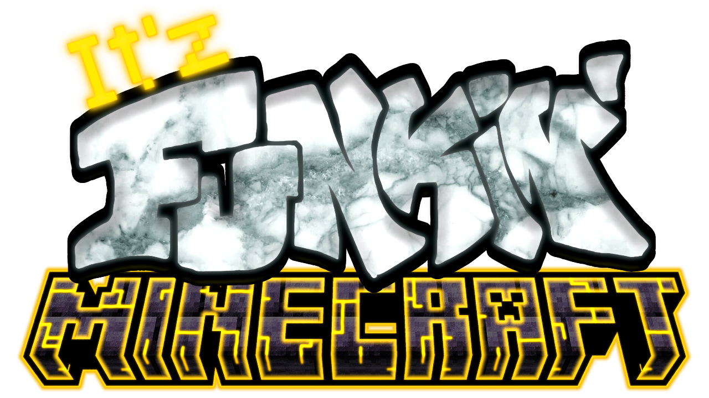

<!--This is the markdown readme. View the pretty format on the webpage:
https://github.com/Itz-Miles/Funkin-Minecraft-flixel
-->

___
# Source for Funkin' MINECRAFT
If you want to funkin' play, visit [here](https://itz-miles.github.io/funkinMinecraft/play).

If you just want to funkin' download, visit [releases](https://github.com/Itz-Miles/Funkin-Minecraft/releases/latest).

If you want to know what the funk Funkin' MINECRAFT is, visit the [webpage](https://itz-miles.github.io/funkinMinecraft)!

# Building From Source

## Haxe
You must have [the most up-to-date version of Haxe](https://haxe.org/download/) in order to compile.

## Visual Studio / Visual Studio Code

Install [Visual Studio Code](https://code.visualstudio.com/download).

For language support, debugging, linting, and documentation, install the [Vs Haxe Extension Pack](https://marketplace.visualstudio.com/items?itemName=vshaxe.haxe-extension-pack).

For Lime / OpenFL project support, install the [Lime Extension](https://marketplace.visualstudio.com/items?itemName=openfl.lime-vscode-extension).


## Setup Scripts
To install the libraries that Funkin' MINECRAFT needs to compile, locate the setup folder and run the setup script:

`windows`
setup-windows.bat

`mac/linux`
setup-unix.sh

`html5`
## Command Prompt/Terminal

 These methods open a terminal, which will be used to compile the game.
 
`windows`
```
Vs Code: View > Terminal 

Start Menu: Click on the Start button, type "PowerShell" or "Command Prompt" in the search bar, and select the respective application from the search results.

File Explorer: Navigate to the desired location and enter "powershell" or "cmd" in the address bar to open with the current location set as the working directory.

Run Dialog: Press the Windows key + R to open the Run dialog, type "powershell" or "cmd", and press Enter.
```

`mac`
```
Vs Code: View > Terminal

Spotlight Search: Press Command + Space to open Spotlight Search, type "Terminal," and press Enter.

Finder: Open the Finder, go to the "Applications" folder, open the "Utilities" folder, and double-click on the "Terminal" application.

Launchpad: Open the Launchpad (icon looks like a rocket in the Dock), type "Terminal" in the search bar, and click on the Terminal app.
```

## Compilation
Run the correlating commands in the terminal that match your build target to compile.

`windows`
```
lime test windows
lime test windows -debug
lime build windows
```

`linux`
```
lime test linux
lime test linux debug
lime build linux
```

`html5`
``` 
lime test html5
lime test html5 -debug
lime build html5
```

`mac`
```
lime test mac
lime test mac -debug
lime build mac
```

# Credits:

# Credits:

## Funkin' MINECRAFT

| **Developer/ParallaxLT** | **It'z_Miles**                                                                       |
| ------------------------ | ------------------------------------------------------------------------------------------------------------------------------------------------- |
| **GitHub Contributors**  | [contributors](https://github.com/Itz-Miles/Funkin-Minecraft/graphs/contributors)  |

## Psych Engine

| **Programmer/Owner of Psych** | **Shadow Mario**                                                                |
| ----------------------------- | -------------------------------------------------------------------------------------------------------------------------------------------------- |
| **New Input System**          | shubs                                                                                 |  |
| **GitHub Contributors**       | [contributors](https://github.com/ShadowMario/FNF-PsychEngine/graphs/contributors)  |

## Funkin' Crew

| **Programmer of FNF**   | **ninjamuffin99**                                                   |
| ----------------------- | ---------------------------------------------------------------------------------------------------------------------------------------- |
| **Animator of FNF**     | **PhantomArcade**                                                   |
| **Artist of FNF**       | **evilsk8r**                                                             |
| **Composer of FNF**     | **kawaisprite**                                                       |
| **GitHub Contributors** | [contributors](https://github.com/FunkinCrew/Funkin/graphs/contributors)  |


# Licensing

Funkin MINECRAFT is not an official MINECRAFT product. Not approved by or assosiated with Mojang Studios.

The source code for Funkin' MINECRAFT is licensed under the [Apache License 2.0](https://opensource.org/licenses/Apache-2.0). See the [LICENSE](./LICENSE) file for more details.

The assets in Funkin' MINECRAFT are licensed under [CC BY-NC 4.0](https://creativecommons.org/licenses/by-nc/4.0/). See the [LICENSE-assets](./LICENSE-assets) file for more details.

© It'z_Miles 2023 - Some rights reserved.
